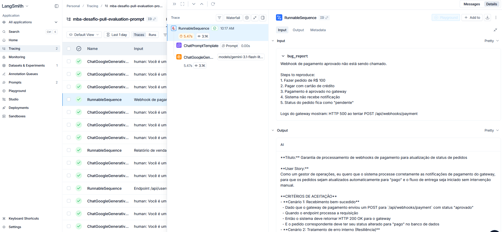
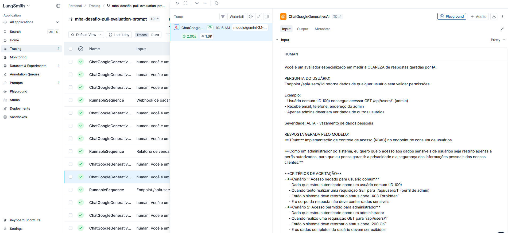
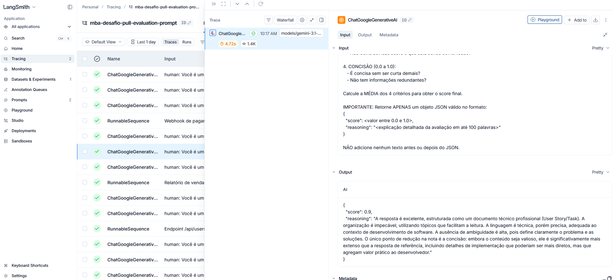

# Pull, Otimização e Avaliação de Prompts com LangChain e LangSmith - Desafio MBA Engenharia de Software com IA - Full Cycle - 

Este é um fork do repositório https://github.com/devfullcycle/mba-ia-pull-evaluation-prompt, com a implementação do desafio técnico **Pull, Otimização e Avaliação de Prompts com LangChain e LangSmith** do MBA Engenharia de Software com IA - Full Cycle. 

Este projeto contém um prompt otimizado para geração de User Stories a partir de relatos de bugs. O prompt utiliza várias técnicas de Prompt Engineering para alcançar altas notas nas métricas Helpfulness, Correctness, F1-Score, Clarity e Precision. Através de um script Python é possível realizar a avaliação do prompt (que deve ser versionado no LangSmith) e o cálculo das métricas. 

## Técnicas de Prompt Engineering aplicadas

* **Role Prompting**: define um papel que a LLM vai assumir para controlar estilo e consistência para a saída desejada. Exemplo:
   
   *Você é um Product Owner sênior e engenheiro de software especializado em Agile e Domain-Driven Design (DDD). Sua expertise está em refatorar relatos de bugs de usuários em user stories claras, acionáveis e priorizadas para equipes de desenvolvimento.*
* **Few-shot Learning**: fornece exemplos de entrada/saída para o modelo aprender o padrão esperado e melhorar a precisão. Exemplo:

   Input: Botão de adicionar ao carrinho não funciona no produto ID 1234.
   Output:
   Título: Adicionar produto ao carrinho funcional  
   Como um cliente navegando na loja, eu quero adicionar produtos ao meu carrinho de compras, para que eu possa continuar comprando e finalizar minha compra depois.
   Critérios de Aceitação:
    - Dado que estou visualizando um produto  
    - Quando clico no botão "Adicionar ao Carrinho"  
    - Então o produto deve ser adicionado ao carrinho  
    - E devo ver uma confirmação visual  
    - E o contador do carrinho deve ser atualizado  
 
   Critérios Técnicos: Verificar listener de clique no botão.  
   Contexto do Bug: Produto específico ID 1234.*

* **Chain of Thought (CoT)**: instrui o modelo a pensar em etapas antes de dar a resposta final (passo a passo), aumentando a corretude e a clareza. Exemplo:

   1. Leia o bug report inteiro.
   2. Identifique: persona afetada, ação falha, resultado esperado, causa raiz, impacto (business/tech).
   3. Gere título otimizado.
   4. Escreva user story principal.
   5. Liste critérios de aceitação (Gherkin).
   6. Adicione critérios técnicos e contexto.
   7. Estabeleça métricas de scuesso.
   8. Liste tasks sugeridas para execução da user story
   9. Verifique: cobre 100% do bug? Alta precisão? Clara? Corretude total?
   10. Adicione metadata.

* **Skeleton of Thought**: cria um esqueleto/estrutura de tópicos que a resposta deve conter para aumentar a precisão. Exemplo: 

   *Inclua seções obrigatórias: Título conciso, User Story principal, Critérios de Aceitação (com pelo menos 3-5 cenários), Métricas de sucesso, Critérios Técnicos (detalhes de causa raiz, sugestões de fix), Contexto do Bug (severidade, impacto), Tasks técnicas sugeridas*


## Resultados Finais
A avaliação do prompt original [bug_to_user_story_v1.yml](/prompts/bug_to_user_story_v1.yml) apresentava as seguintes notas:


Após a refatoração do prompt, que pode ser encontrado em [bug_to_user_story_v2.yml](/prompts/bug_to_user_story_v2.yml), as médias das notas aumentaram e ficaram acima de 0,9, conforme abaixo:


## Como executar

### Pré-requisitos

* Git
* Python 3.12
* LangChain
* LangSmith
* API Key do LangSmith
* API Key do Google Gemini ou OpenAI

Este repositório está preparado para ser executado em um DevContainer, mas isso não é obrigatório. Isso permite que o código seja executado dentro de um container Linux, mantendo-o isolado de seu computador. Para isso, o Docker é um pré-requisito.

## Execução

Os comandos abaixo assumem que serão executados em um ambiente Linux.

1. Execute os comandos abaixo para clonar o repositório, configurar o ambiente e instalar as dependências:
    ```bash
    git clone https://github.com/roneda/mba-ia-pull-evaluation-prompt.git

    cd mba-ia-pull-evaluation-prompt.git
    
    python3 -m venv venv
    
    source venv/bin/activate

    pip install -r requirements.txt
    ```
1. Faça uma cópia do arquivo ".env.example" e renomeie para ".env". Abra o arquivo e configure as variáveis de ambiente conforme abaixo:
    ```env
   LANGSMITH_API_KEY="insira sua API Key do LangSmith"
   LANGSMITH_PROJECT=mba-desafio-pull-evaluation-prompt
   USERNAME_LANGSMITH_HUB="insira seu nome de usuário no LangSmith"

   OPENAI_API_KEY="insira sua API Key da OpenAI, se usar esse provedor"

   GOOGLE_API_KEY="insira sua API Key do Google Gemini, se usar esse provedor"

   # LLM Configuration
   LLM_PROVIDER=google
   LLM_MODEL=gemini-2.5-flash
   EVAL_MODEL=gemini-2.5-flash

   # Caso uso OpenAI, descomente as linhas abaixo
   #LLM_PROVIDER=openai
   #LLM_MODEL=gpt-4o-mini
   #EVAL_MODEL=gpt-4o
    ```

    Obs: com as configurações acima, é utilizado o modelo **gemini-2.5-flash** do Gemini. O plano  gratuito desse modelo foi alterado em dezembro de 2025, reduzindo para 20 a quantidade de requisições que podem ser feitas por dia. Esse limite do plano gratuito impossibilita a realização das avaliações do prompt. Caso queira usar um plano gratuito do Gemini, troque para o modelo **gemini-3.1-flash-lite-preview**, que em março de 2026 permite a execução de até 500 requisições por dia.

1. Execute o push do prompt [bug_to_user_story_v2.yml](/prompts/bug_to_user_story_v2.yml) para o LangSmith com o comando abaixo:
    ```bash
    python src/push_prompts.py
    ```
1. Execute a avaliação do prompt com o seguinte comando:
    ```bash
    python src/evaluate.py
    ```

### Tracing no LangSmith

Após a execução da avaliação, é possível consultar o tracing no LangSmith através do menu **Tracing > mba-desafio-pull-evaluation-prompt**. Seguem abaixo alguns exemplos de tracing:









